# MAMMOWAVE — Test di Ripetibilità

Analisi completa della ripetibilità delle misurazioni MAMMOWAVE su 9 pazienti, 180 acquisizioni, 5 metriche, 6 fasi e 4 coppe.

> **Nota sulla versione**: questo documento è basato sulla versione **V3 Definitiva** del report (dataset corretto: flag qualità aggiornati, età corrette, `Cup_Role` corretto per la paziente 800X). I numeri riportati qui sostituiscono quelli di eventuali analisi preliminari — in particolare, la correlazione tra età e metriche, inizialmente marginale/significativa, **non risulta più statisticamente significativa** dopo le correzioni.

## Indice

- [Sintesi delle correzioni applicate](#sintesi-delle-correzioni-applicate)
- [1. Dataset e qualità delle acquisizioni](#1-dataset-e-qualità-delle-acquisizioni)
- [2. Dataset completo vs dataset pulito](#2-dataset-completo-vs-dataset-pulito)
- [3. Ripetibilità intra-sessione](#3-ripetibilità-intra-sessione)
- [4. Test di normalità](#4-test-di-normalità)
- [5. Ripetibilità inter-sessione](#5-ripetibilità-inter-sessione)
- [6. Analisi delle coppe](#6-analisi-delle-coppe)
- [7. Analisi per paziente e seno](#7-analisi-per-paziente-e-seno)
- [8. Analisi dedicata a max2avg](#8-analisi-dedicata-a-max2avg)
- [9. Correlazione con l'età](#9-correlazione-con-letà)
- [10. Visualizzazioni multi-metrica](#10-visualizzazioni-multi-metrica)
- [11. Conclusioni](#11-conclusioni)

---

## Sintesi delle correzioni applicate

- **100X**: aggiunto il flag `MOVIMENTO_LIEVE` sulla Fase 1, seno sinistro; il dato è mantenuto perché l'effetto è trascurabile.
- **800X**: tre eventi precedentemente esclusi come `MOVIMENTO` sono stati riclassificati come `MOVIMENTO_INTERVALLO` e ripristinati nel dataset.
- **800X**: `Cup_Role` corretto — la sessione reale è iniziata con Base-1, quindi Base = coppa II.
- **Età corrette**: 200X = 46 anni (non 65); 400X = 64 anni (non 63).
- **Regola di esclusione finale**: si escludono solo i casi di `MOVIMENTO` confermato durante l'acquisizione e `NO_CAMERA+INCOMPLETA`.
- Le correlazioni con l'età **non sono statisticamente significative** dopo la correzione.

---

## 1. Dataset e qualità delle acquisizioni

Il dataset comprende **180 acquisizioni totali** su **9 pazienti** (età 43–68 anni), raccolte su **6 fasi**, **4 coppe** e **2 seni**. Dopo l'applicazione della regola di esclusione corretta, il dataset pulito contiene **177 acquisizioni**. Le acquisizioni con flag informativo ma non invalidante sono mantenute nell'analisi.

### Tabella 1 — Profilo pazienti (età corrette e metriche principali)

| Paziente | Età | max_n medio | max2avg medio | max_n CV% | max2avg CV% | Taglia |
|---|---|---|---|---|---|---|
| 100X | 56 | 0.7679 | 2.4554 | 18.33 | 15.35 | Tg.IV |
| 200X | 46 | 0.3653 | 2.2995 | 10.71 | 7.90 | Tg.II |
| 300X | 68 | 0.7508 | 2.3640 | 14.28 | 4.92 | Tg.IV |
| 400X | 64 | 0.4721 | 2.2725 | 14.07 | 8.82 | Tg.III |
| 500X | 54 | 0.2997 | 2.0249 | 6.72 | 4.57 | Tg.II |
| 600X | 43 | 0.2483 | 2.0580 | 6.32 | 4.20 | Tg.II |
| 700X | 64 | 0.3127 | 2.1017 | 16.33 | 9.48 | Tg.IIIc |
| 800X | 47 | 0.1667 | 1.7381 | 8.08 | 7.86 | Tg.II |
| 900X | 53 | 0.3217 | 2.1664 | 14.68 | 8.02 | Tg.II |

### Tabella 2 — Distribuzione dei flag qualità (su 180 acquisizioni)

| Flag qualità | N acquisizioni | % sul totale |
|---|---|---|
| OK | 139 | 77.20% |
| NO_CAMERA | 25 | 13.90% |
| ORDINE_INV | 8 | 4.40% |
| MOVIMENTO_INTERVALLO | 3 | 1.70% |
| NO_CAMERA+MOVIMENTO_LIEVE | 2 | 1.10% |
| NO_CAMERA+INCOMPLETA | 2 | 1.10% |
| MOVIMENTO | 1 | 0.60% |

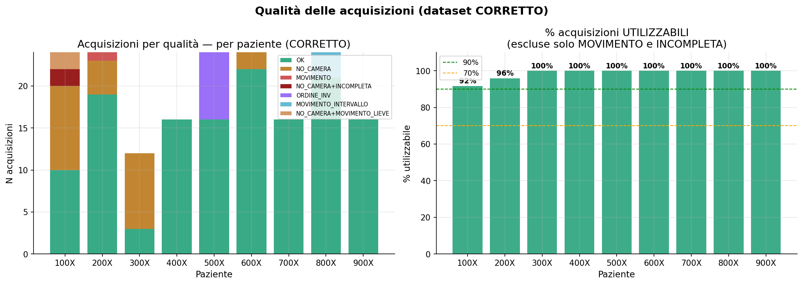
*Figura 1 — Acquisizioni per livello di qualità per paziente e percentuale di acquisizioni utilizzabili.*

### Regola di esclusione e acquisizioni ripristinate

Sono escluse solo **3 acquisizioni**: 1 `MOVIMENTO` confermato durante l'acquisizione e 2 `NO_CAMERA+INCOMPLETA`. Sono invece mantenute le acquisizioni `NO_CAMERA`, `NO_CAMERA+MOVIMENTO_LIEVE`, `MOVIMENTO_INTERVALLO` e `ORDINE_INV`, perché non corrompono direttamente la misura o sono correggibili nella logica di sessione.

### Tabella 3 — Acquisizioni 800X ripristinate come MOVIMENTO_INTERVALLO

| Paziente | Fase | Seno | Acq_n | Coppa | Cup_Role |
|---|---|---|---|---|---|
| 800X | 1 | RIGHT | 2 | I | Base-1 |
| 800X | 3 | LEFT | 1 | II | Base |
| 800X | 3 | RIGHT | 2 | II | Base |

---

## 2. Dataset completo vs dataset pulito

Il confronto tra dataset completo e dataset pulito verifica se la pulizia dei flag modifica la ripetibilità media. **L'impatto è trascurabile**: tutte le differenze di CV% sono inferiori a 0.15 punti percentuali.

### Tabella 4 — Confronto CV% medio: dataset completo vs dataset pulito

| Metrica | CV% completo | CV% pulito | Δ CV% | Impatto |
|---|---|---|---|---|
| max_n | 11.43 | 11.44 | 0.00 | Trascurabile |
| max2avg | 7.87 | 7.88 | 0.02 | Trascurabile |
| var_p | 53.28 | 53.23 | -0.05 | Trascurabile |
| mad_p | 30.83 | 30.81 | -0.02 | Trascurabile |
| var_r | 56.03 | 55.89 | -0.14 | Trascurabile |

---

## 3. Ripetibilità intra-sessione

Misura la concordanza tra due acquisizioni consecutive nella stessa fase, senza riposizionamento della paziente. Nel dataset pulito corretto sono disponibili **85 coppie intra-sessione**.

Legenda CV%: **<10%** ottimo · **10–15%** buono · **15–25%** moderato · **>25%** alto.

### Tabella 5 — CV%, SEM e MDC95 per metrica e seno

| Metrica | Seno | N | CV% medio | SEM | MDC95 | MDC% |
|---|---|---|---|---|---|---|
| max_n | GLOBALE | 85 | 11.44 | 0.0596 | 0.1652 | 43.70 |
| max_n | LEFT | 42 | 13.58 | 0.0746 | 0.2069 | 56.47 |
| max_n | RIGHT | 43 | 9.34 | 0.0408 | 0.1130 | 29.02 |
| max2avg | GLOBALE | 85 | 7.88 | 0.1788 | 0.4956 | 23.21 |
| max2avg | LEFT | 42 | 9.37 | 0.2076 | 0.5755 | 27.09 |
| max2avg | RIGHT | 43 | 6.44 | 0.1472 | 0.4081 | 19.02 |
| var_p | GLOBALE | 85 | 53.23 | 0.0313 | 0.0867 | 210.2 |
| var_p | LEFT | 42 | 58.15 | 0.0357 | 0.0988 | 240.9 |
| var_p | RIGHT | 43 | 48.43 | 0.0267 | 0.0739 | 178.1 |
| mad_p | GLOBALE | 85 | 30.81 | 0.0406 | 0.1124 | 88.30 |
| mad_p | LEFT | 42 | 33.18 | 0.0452 | 0.1253 | 95.98 |
| mad_p | RIGHT | 43 | 28.50 | 0.0359 | 0.0996 | 80.30 |
| var_r | GLOBALE | 85 | 55.89 | 0.2797 | 0.7753 | 209.3 |
| var_r | LEFT | 42 | 62.07 | 0.3273 | 0.9071 | 243.7 |
| var_r | RIGHT | 43 | 49.86 | 0.2242 | 0.6215 | 168.6 |

**max2avg** è la metrica con la ripetibilità migliore (CV% globale 7.88%, MDC% 23.21%), seguita da **max_n** (CV% 11.44%). Le metriche `var_p`, `mad_p` e `var_r` mostrano CV% molto più elevati e devono essere interpretate con cautela.

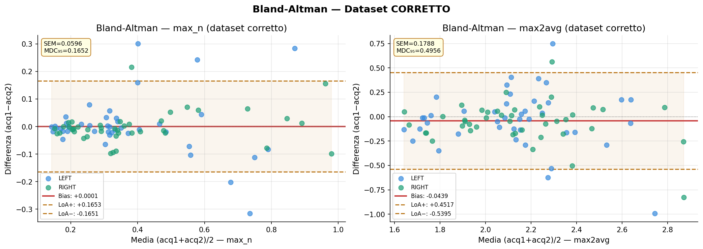
*Figura 2 — Bland-Altman intra-sessione per max_n e max2avg.*

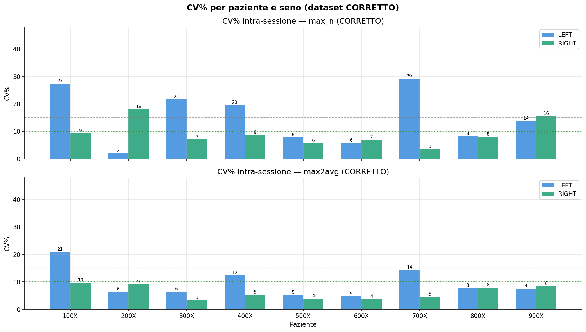
*Figura 3 — CV% intra-sessione per paziente e seno, per max_n e max2avg.*

---

## 4. Test di normalità

Il test di Shapiro-Wilk mostra che **nessuna delle cinque metriche segue una distribuzione normale** (p<0.05). Questo giustifica l'uso di test non parametrici: Kruskal-Wallis, Mann-Whitney, Wilcoxon e Spearman.

### Tabella 6 — Test di Shapiro-Wilk per normalità

| Metrica | N | W | p | Normale? |
|---|---|---|---|---|
| max_n | 85 | 0.862 | 0.000 | NO |
| max2avg | 85 | 0.969 | 0.041 | NO |
| var_p | 85 | 0.791 | 0.000 | NO |
| mad_p | 85 | 0.959 | 0.0088 | NO |
| var_r | 85 | 0.815 | 0.000 | NO |

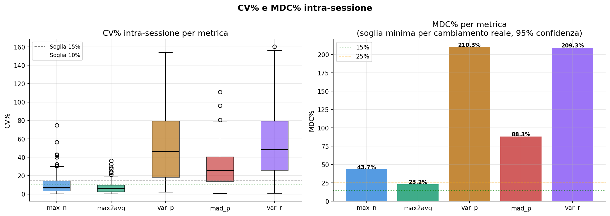

---

## 5. Ripetibilità inter-sessione

Confronta la Sessione A e la Sessione B con la stessa coppa, dopo riposizionamento della paziente. Sono state individuate **41 coppie A↔B complete**.

### Tabella 7 — Confronto intra-sessione vs inter-sessione

| Metrica | CV% intra | CV% inter | Ratio inter/intra | MDC% intra | MDC% inter |
|---|---|---|---|---|---|
| max_n | 11.44 | 21.29 | ×1.86 | 43.70 | 50.71 |
| max2avg | 7.88 | 9.48 | ×1.20 | 23.21 | 23.52 |
| var_p | 53.23 | 56.78 | ×1.07 | 210.2 | 173.3 |
| mad_p | 30.81 | 33.39 | ×1.08 | 88.30 | 86.41 |
| var_r | 55.89 | 57.93 | ×1.04 | 209.3 | 174.1 |

Il riposizionamento aumenta soprattutto la variabilità di **max_n**, che passa da 11.44% a 21.29% (ratio ×1.86). **max2avg** è molto meno sensibile al riposizionamento: da 7.88% a 9.48% (ratio ×1.20).

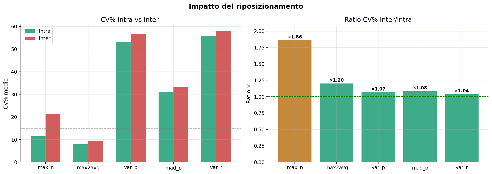
*Figura 4 — CV% intra vs inter-sessione e relativo rapporto inter/intra.*

---

## 6. Analisi delle coppe

Ogni paziente è stata misurata con più coppe. L'analisi valuta sia l'effetto della coppa sui valori assoluti sia la stabilità di misura. La correzione del `Cup_Role` per 800X è applicata in tutte le analisi.

### Tabella 8 — Statistiche di ripetibilità per coppa

| Coppa | Metrica | N | Media | CV% medio | MDC% |
|---|---|---|---|---|---|
| I | max_n | 20 | 0.2564 | 10.65 | 29.75 |
| I | max2avg | 20 | 2.0537 | 7.85 | 18.97 |
| II | max_n | 32 | 0.3484 | 11.58 | 44.72 |
| II | max2avg | 32 | 2.1063 | 7.51 | 21.19 |
| III | max_n | 14 | 0.6153 | 18.04 | 49.63 |
| III | max2avg | 14 | 2.3454 | 10.45 | 31.97 |
| III teflon | max_n | 19 | 0.3809 | 7.16 | 27.16 |
| III teflon | max2avg | 19 | 2.1141 | 6.66 | 22.15 |

### Tabella 9 — Kruskal-Wallis: effetto della coppa sulle metriche

| Metrica | H | p-value | Sig. |
|---|---|---|---|
| max_n | 24.12 | 2.00e-05 | *** |
| max2avg | 8.74 | 0.0329 | * |
| var_p | 7.91 | 0.0479 | * |
| mad_p | 6.93 | 0.0741 | ns |
| var_r | 6.24 | 0.1006 | ns |

`***` p<0.001 differenza estremamente significativa · `*` p<0.05 differenza statisticamente significativa · `ns` p≥0.05 nessuna differenza rilevante.

### Tabella 10 — Confronti pairwise Mann-Whitney tra coppe (max_n)

| Coppa A | Coppa B | Δ mediana | p-value | Sig. |
|---|---|---|---|---|
| I | II | +30.9% | 0.0328 | * |
| I | III | +118.3% | 0.0000 | *** |
| I | III teflon | +20.2% | 0.1643 | ns |
| II | III | +66.7% | 0.0001 | *** |
| II | III teflon | -8.1% | 0.9922 | ns |
| III | III teflon | -44.9% | 0.0030 | ** |

La coppa **III standard** produce valori di max_n molto più alti e meno stabili. La **III teflon** mostra invece la migliore ripetibilità e risulta statisticamente equivalente alla coppa II per max_n.

### 6.1 Confronto Base corretta vs III teflon

Il confronto diretto include 36 coppie Base su 9 pazienti e 19 coppie III teflon su 5 pazienti. Non emergono differenze statisticamente significative nei valori delle metriche, ma la teflon mostra CV% più basso su quasi tutte le metriche, in particolare su max_n.

### Tabella 11 — Confronto Base corretta vs III teflon

| Metrica | Base media | Teflon media | Δ mediana % | p-value | Sig. | CV% Base | CV% Teflon |
|---|---|---|---|---|---|---|---|
| max_n | 0.3706 | 0.3809 | -3.6 | 0.9788 | ns | 12.10 | 7.2 |
| max2avg | 2.1241 | 2.1141 | -0.4 | 0.9084 | ns | 7.5 | 6.7 |
| var_p | 0.0404 | 0.0394 | -19.50 | 0.639 | ns | 50.70 | 41.90 |
| mad_p | 0.1286 | 0.1250 | -0.7 | 0.6016 | ns | 27.10 | 29.20 |
| var_r | 0.3636 | 0.3395 | -18.30 | 0.6016 | ns | 52.80 | 44.40 |

### Tabella 12 — Confronto within-patient Base vs III teflon (max_n)

| Paziente | Coppa Base | max_n Base | max_n Teflon | Δ% |
|---|---|---|---|---|
| 100X | II | 0.7192 | 0.7718 | +7.3 |
| 200X | I | 0.3314 | 0.3640 | +9.9 |
| 500X | I | 0.2566 | 0.2994 | +16.70 |
| 600X | I | 0.2349 | 0.2871 | +22.20 |
| 800X | II | 0.1548 | 0.1779 | +14.90 |

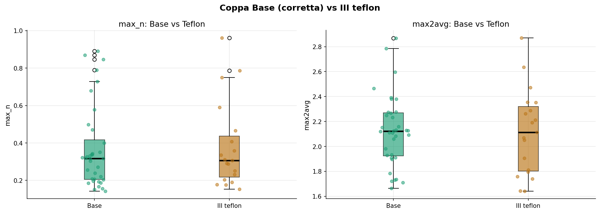
*Figura 5 — Boxplot Base vs III teflon per max_n e max2avg.*

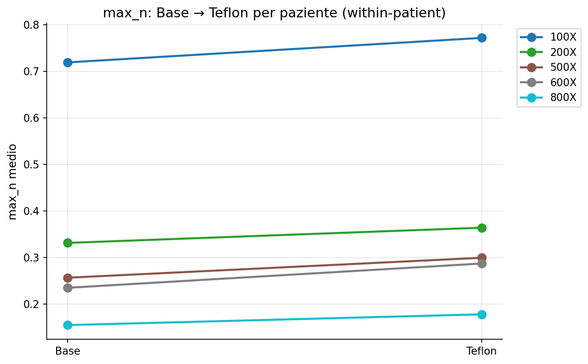
*Figura 6 — Variazione within-patient di max_n da Base a III teflon.*

---

## 7. Analisi per paziente e seno

### 7.1 Capacità discriminante

L'indice eta-quadro (η²) misura la quota di varianza spiegata dall'identità della paziente. Tutte le metriche distinguono significativamente le pazienti; **max_n è la metrica più discriminante**.

### Tabella 13 — Capacità discriminante per paziente

| Metrica | η² | Varianza paziente | p-value | Sig. |
|---|---|---|---|---|
| max_n | 0.801 | 80.1% | 0.000 | *** |
| max2avg | 0.453 | 45.3% | 0.000 | *** |
| mad_p | 0.300 | 30.0% | 0.000 | *** |
| var_p | 0.240 | 24.0% | 0.000 | *** |
| var_r | 0.199 | 19.9% | 0.000 | *** |

### 7.2 Profilo per paziente e seno

### Tabella 14 — Profilo per paziente e seno: metriche principali

| Paziente | Seno | Età | Taglia | N | max_n medio | max_n CV% | max2avg medio | max2avg CV% |
|---|---|---|---|---|---|---|---|---|
| 100X | LEFT | 56 | Tg.IV | 12 | 0.6713 | 20.31 | 2.3338 | 15.07 |
| 100X | RIGHT | 56 | Tg.IV | 12 | 0.8776 | 13.98 | 2.5452 | 12.57 |
| 200X | LEFT | 46 | Tg.II | 12 | 0.3754 | 13.57 | 2.3099 | 10.43 |
| 200X | RIGHT | 46 | Tg.II | 12 | 0.3581 | 22.04 | 2.2575 | 8.23 |
| 300X | LEFT | 68 | Tg.IV | 6 | 0.7438 | 21.55 | 2.1940 | 8.98 |
| 300X | RIGHT | 68 | Tg.IV | 6 | 0.6989 | 21.53 | 2.4772 | 11.24 |
| 400X | LEFT | 64 | Tg.III | 8 | 0.4587 | 24.75 | 2.2193 | 10.62 |
| 400X | RIGHT | 64 | Tg.III | 8 | 0.4856 | 19.57 | 2.3258 | 6.88 |
| 500X | LEFT | 54 | Tg.II | 12 | 0.2680 | 22.82 | 1.9716 | 10.28 |
| 500X | RIGHT | 54 | Tg.II | 12 | 0.3315 | 16.97 | 2.0782 | 9.11 |
| 600X | LEFT | 43 | Tg.II | 12 | 0.2501 | 23.29 | 2.0699 | 7.26 |
| 600X | RIGHT | 43 | Tg.II | 12 | 0.2466 | 22.21 | 2.0461 | 5.97 |
| 700X | LEFT | 64 | Tg.IIIc | 8 | 0.3322 | 42.35 | 2.2214 | 17.61 |
| 700X | RIGHT | 64 | Tg.IIIc | 8 | 0.2933 | 38.49 | 1.9819 | 4.91 |
| 800X | LEFT | 47 | Tg.II | 12 | 0.1577 | 10.05 | 1.7361 | 5.72 |
| 800X | RIGHT | 47 | Tg.II | 12 | 0.1757 | 11.43 | 1.7402 | 6.43 |
| 900X | LEFT | 53 | Tg.II | 8 | 0.3271 | 10.84 | 2.1818 | 5.42 |
| 900X | RIGHT | 53 | Tg.II | 8 | 0.3164 | 21.34 | 2.1511 | 8.88 |

### 7.3 Asimmetria LEFT/RIGHT

L'asimmetria è calcolata come `(LEFT−RIGHT)/media×100`. Le differenze più marcate su max_n sono osservate in 100X e 500X, con seno destro più alto.

### Tabella 15 — Asimmetria tra seno sinistro e destro

| Paziente | Età | Taglia | max_n_delta% | max2avg_delta% |
|---|---|---|---|---|
| 100X | 56 | Tg.IV | -26.64 | -8.67 |
| 200X | 46 | Tg.II | +4.72 | +2.29 |
| 300X | 68 | Tg.IV | +6.22 | -12.13 |
| 400X | 64 | Tg.III | -5.70 | -4.69 |
| 500X | 54 | Tg.II | -21.18 | -5.26 |
| 600X | 43 | Tg.II | +1.41 | +1.16 |
| 700X | 64 | Tg.IIIc | +12.44 | +11.40 |
| 800X | 47 | Tg.II | -10.80 | -0.24 |
| 900X | 53 | Tg.II | +3.33 | +1.42 |

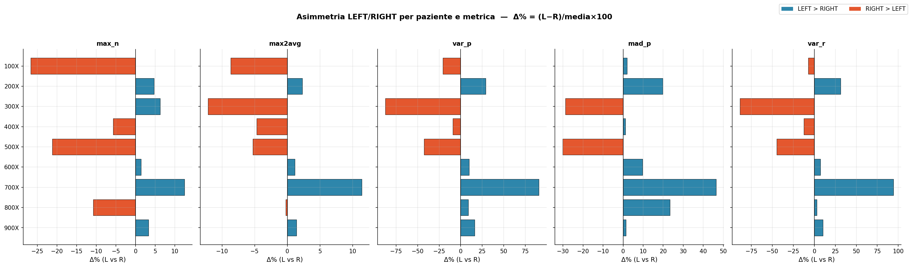

---

## 8. Analisi dedicata a max2avg

`max2avg` è la metrica migliore: combina CV% intra-sessione basso, buona stabilità inter-sessione, basso effetto del riposizionamento e capacità discriminante intermedia. Un cambiamento superiore a circa 23–24% può essere considerato superiore alla minima differenza rilevabile al 95%.

### Tabella 16 — Sintesi dedicata a max2avg

| Proprietà | Valore | Interpretazione |
|---|---|---|
| CV% intra-sessione | 7.88% | Ottima ripetibilità immediata |
| CV% inter-sessione | 9.48% | Buona stabilità dopo riposizionamento |
| Ratio inter/intra | ×1.20 | Bassa sensibilità al riposizionamento |
| MDC% intra | 23.21% | Soglia di cambiamento reale nella stessa sessione |
| MDC% inter | 23.52% | Soglia di cambiamento reale tra sessioni |
| η² | 0.453 | Buona discriminazione tra pazienti |
| Età | non significativa | Nessuna correlazione statisticamente significativa |

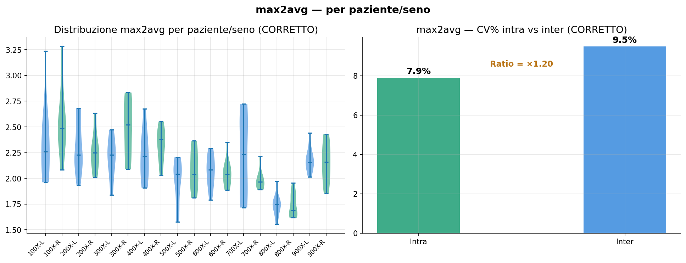
*Figura 7 — Distribuzione max2avg per paziente/seno e confronto CV% intra/inter.*

---

## 9. Correlazione con l'età

Dopo la correzione delle età, **nessuna correlazione con l'età risulta statisticamente significativa** al livello p<0.05. La precedente conclusione di correlazione significativa (basata sulle età non corrette) è rimossa dal report definitivo.

### Tabella 17 — Correlazione di Spearman tra età corretta e metriche

| Confronto | r Spearman | p-value | Esito |
|---|---|---|---|
| Età vs max_n medio | +0.594 | 0.0916 | ns |
| Età vs max2avg medio | +0.435 | 0.2418 | ns |
| Età vs max_n CV% | +0.611 | 0.0805 | ns |
| Età vs max2avg CV% | +0.427 | 0.2520 | ns |

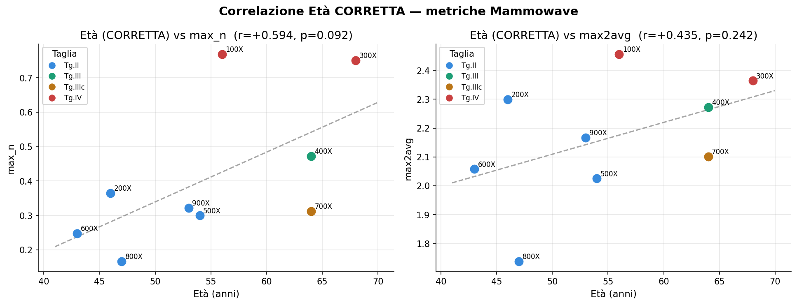
*Figura 8 — Correlazione tra età corretta e max_n/max2avg.*

---

## 10. Visualizzazioni multi-metrica

Le visualizzazioni multi-metrica mostrano il profilo normalizzato delle cinque metriche per ogni combinazione paziente/seno, permettendo di verificare coerenze e discrepanze tra le metriche.

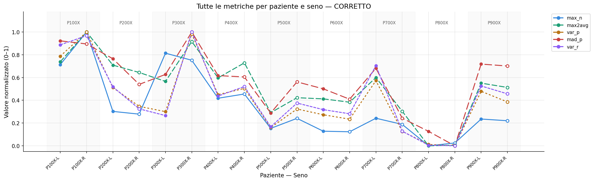
*Figura 9 — Tutte le metriche normalizzate 0–1 per paziente e seno.*

---

## 11. Conclusioni

- **Il segnale non è rumore casuale.** Tutte le metriche distinguono le pazienti con p<0.00001; `max_n` spiega l'80.1% della varianza attribuibile all'identità della paziente.
- **max2avg è la metrica più stabile.** CV% 7.88% intra-sessione, 9.48% inter-sessione e ratio ×1.20 indicano robustezza al riposizionamento.
- **max_n è la metrica più discriminante ma più sensibile.** Ha η²=0.801, ma aumenta la variabilità tra sessioni e risente maggiormente della coppa.
- **La III teflon è la coppa più stabile.** Mostra CV% 7.16% per max_n e 6.66% per max2avg; è statisticamente equivalente alla Base nei valori, ma più stabile.
- **Le correzioni dei flag non cambiano la ripetibilità complessiva.** Il dataset pulito passa da 174 a 177 acquisizioni e l'impatto sul CV% medio è trascurabile.
- **Non c'è correlazione significativa con l'età.** Dopo le correzioni, tutte le correlazioni età-metriche sono non significative.
- **LEFT tende a essere più variabile di RIGHT.** Nelle tabelle intra-sessione il seno sinistro mostra CV% più alto del destro per tutte le metriche principali.

---

## Struttura del repository

```
.
├── README.md
└── images/
    ├── image1.png   # Fig.1 — Qualità acquisizioni per paziente
    ├── image2.png   # Fig.2 — Bland-Altman intra-sessione
    ├── image3.png   # Fig.3 — CV% intra-sessione per paziente/seno
    ├── image4.png   # Confronto qualità acquisizioni
    ├── image5.png   # Fig.4 — CV% intra vs inter-sessione
    ├── image6.png   # Fig.5 — Boxplot Base vs III teflon
    ├── image7.png   # Fig.6 — Variazione within-patient
    ├── image8.png   # Asimmetria LEFT/RIGHT
    ├── image9.png   # Fig.7 — Distribuzione max2avg
    ├── image10.png  # Fig.8 — Correlazione età vs metriche
    └── image11.png  # Fig.9 — Profilo multi-metrica normalizzato
```

## Fonti

Questo README è stato compilato a partire da due documenti:
- `MAMMOWAVE_Report_Ripetibilita_V3_Definitivo.docx` — report definitivo con dataset corretto (fonte primaria dei dati riportati qui).
- `MAMMOWAVE_Risultati_Completi_Grafici.docx` — analisi preliminare con grafici estesi, usata come riferimento incrociato.
